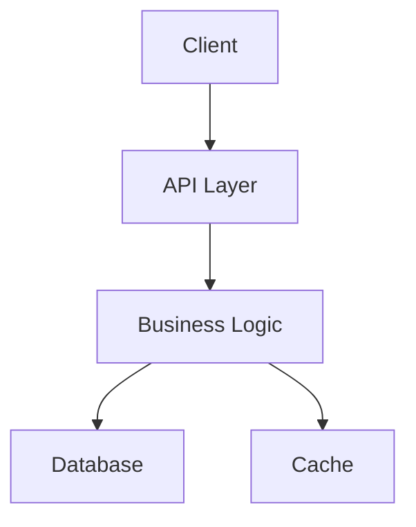
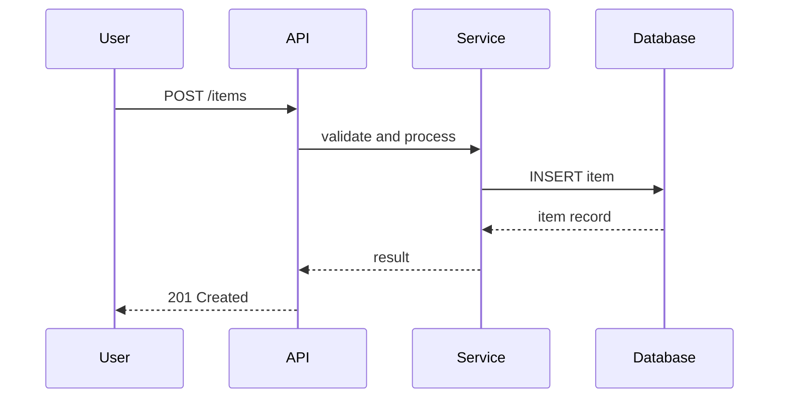

# Output Template

This defines the section structure for the codebase guide output. Sections are
listed in order. Omit sections that do not apply to the project.

---

## Document Header

```markdown
# <Project Name>

> <One-sentence summary: what this project does, in plain language.>
```

The summary line should be understandable by someone who has never heard of the
project. Avoid jargon. If the project is a library, state what it provides. If
it's an application, state what users do with it.

---

## What Is This

3–5 paragraphs in plain, friendly language:

- **Paragraph 1**: What the project does and why it exists.
- **Paragraph 2**: How it works at the highest level (one or two sentences).
- **Paragraph 3**: Who uses it and in what context.
- **Optional**: A real-world analogy that makes the concept concrete. Example:
  "Think of this like a post office sorting machine — messages come in, get
  sorted by rules you define, and land in the right destination."

No jargon without inline definitions. Write as if the reader found this repo
by accident and is deciding whether to keep reading.

---

## Tech Stack

Markdown table with three columns:

```markdown
| Layer | Technology | Purpose |
|-------|-----------|---------|
| Language | Python 3.11 | Main language for backend logic |
| Framework | FastAPI | Handles HTTP requests and routing |
| Database | PostgreSQL | Stores persistent application data |
| Testing | pytest | Runs automated test suites |
```

Rules:
- **Layer** groups technologies by function (Language, Framework, Database,
  Cache, Testing, Build, Deployment, External Services).
- **Purpose** explains WHY this technology is used in this project, not a
  generic definition of the technology.
- Only include rows that apply. A CLI tool might have only Language and Testing.

---

## Project Map

Annotated ASCII directory tree showing the important files and directories.

```
project/
├── src/                  # Application source code
│   ├── core/             # Core domain logic
│   ├── api/              # External-facing interfaces
│   └── utils/            # Shared helper functions
├── tests/                # Test suites
├── config/               # Configuration files
├── docs/                 # Documentation
├── Dockerfile            # Container build instructions
└── package.json          # Dependencies and build scripts
```

Rules:
- Depth: 2–3 levels for most projects. Go deeper for small projects.
- Every entry has an inline annotation (`# explanation`).
- Omit: `node_modules/`, `.git/`, build output, generated files, lock file
  contents.
- If files are omitted, add a brief note explaining why.

---

## Architecture

Start with a one-sentence summary of the architectural pattern:

> "This project uses a layered architecture where requests flow through
> routing, business logic, and data access layers."

Then include a Mermaid diagram:

````markdown

````

Rules:
- Use `graph TD` (top-down) or `graph LR` (left-right).
- Keep to 5–12 nodes. More than 12 needs decomposition into subsystem diagrams.
- Every node has a human-readable label, not a variable name.
- Below the diagram, explain each component in 1–2 sentences.
- Focus on boundaries: what talks to what, what owns what data.

---

## Data Flow

Trace one representative request or operation through the system. Pick the
most common or most illustrative flow.

Option A — Mermaid sequence diagram:

````markdown

````

Option B — Numbered list (for simpler flows):

```markdown
1. User submits form → browser sends POST /api/items
2. `routes/items.ts` receives the request, validates input
3. `services/item.service.ts` processes business rules
4. Database INSERT via the data access layer
5. Response returned: 201 Created with the new item
```

Rules:
- Label each step with the responsible file or module.
- 4–8 participants for sequence diagrams.
- This section makes the architecture concrete — show what happens at runtime.

---

## Key Files Explained

5–10 files that a newcomer should read first, ordered by importance.

Format per file:

```markdown
### `src/index.ts` — Application Entry Point

This is where the application starts. It configures middleware, mounts route
handlers, and starts the HTTP server. Read lines 1–30 for the core setup.

Key concepts in this file:
- Middleware registration (lines 10–15)
- Route mounting (lines 18–25)
```

Rules:
- Always include file path, a role description, and what to focus on.
- For large files, specify line ranges: "Focus on lines 1–50."
- Explain WHAT the file does and WHY it matters, not just WHERE it is.

---

## Key Concepts

Domain-specific concepts that the codebase assumes you know. Only include
concepts that appear in the code and would confuse a newcomer.

Format:

```markdown
**Middleware** — Code that processes every request before it reaches your route
handler. Think of it as a security checkpoint at a building entrance.

**Migration** — A versioned database change. Each migration file describes one
schema modification (add a table, rename a column) and can be applied or
rolled back.
```

Rules:
- Brief: 1–3 sentences per concept.
- Include an analogy when the concept is abstract.
- Skip concepts that are standard for the stack (do not define "component" for
  a React app, or "struct" for a Go project).

---

## How to Run

Prerequisites, setup, and run commands. Copy-pasteable.

```markdown
### Prerequisites

- Node.js 18+ (JavaScript runtime)
- PostgreSQL 15+ (database)

### Quick Start

\```bash
git clone <repo-url>
cd project-name
npm install          # Install dependencies
cp .env.example .env # Create local config (edit with your DB credentials)
npm run dev          # Start development server
# Expected: "Server running at http://localhost:3000"
\```
```

Rules:
- Assume the reader has a computer but may not have dev tools installed yet.
- Include expected output so the reader knows it worked.
- Note any environment variables or configuration that must be set.

---

## Testing

How to run tests. What kinds of tests exist.

```markdown
### Running Tests

\```bash
npm test             # Run all tests
npm test -- auth     # Run tests matching "auth"
\```

### Test Structure

- `tests/unit/` — isolated function tests
- `tests/integration/` — tests that hit the database
```

If no tests exist, note the absence: "This project does not currently include
automated tests."

---

## Where to Go Next

3–5 suggestions for what to explore after reading this document.

Format:

```markdown
1. **Understand the core**: Read `src/core/engine.ts` — this is where the
   main processing logic lives.
2. **See it in action**: Look at `tests/engine.test.ts` — the tests show
   exactly how the engine is called.
3. **Make a small change**: Try adding a new field to the `Item` model and
   trace it through the system.
```

Link to external documentation if it exists (wiki, API docs, contributor
guide).

---

## Glossary

Optional. Include only if the project has domain-specific terminology not
already covered in Key Concepts.

```markdown
| Term | Meaning |
|------|---------|
| **GAQL** | Google Ads Query Language — SQL-like syntax for querying ad data |
| **Impression** | One instance of an ad being displayed to a user |
```

Omit this section entirely for projects with standard vocabulary.
